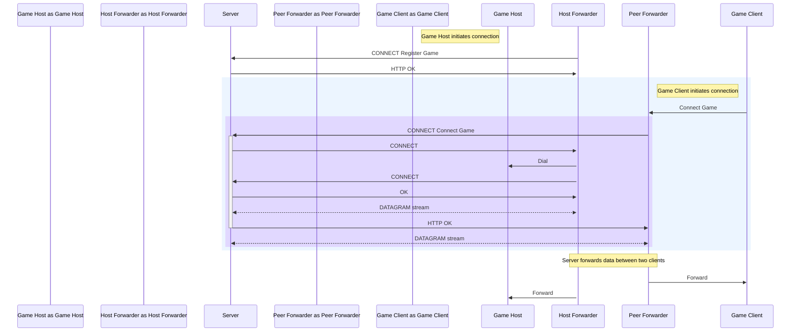

# Star

Ever wanted to play a local game with a friend who is far away? Star makes local multiplayer games playable remotely!

> [!WARNING]  
> This project is a work in progress.

## How to Start

### Deploy a Server

1. Build the server:

    ```sh
    make build registar
    ```
2. Copy the server binary to the target machine.
3. Run the server:
    ```sh
    sudo SECRET=my-secret CERT_DOMAINS=my-domain.com ./registar
    ```

    This will start a relay server named "registar", which listens on ports 80 and 443.
    See more about registar [here](#registar-server).

### Game Host

1. Host the game.
2. Run the client, click "Start a server" -> "Advanced settings."
3. Select the game port on which the game runs.
4. Enter the server's secret.
5. Enter the server's URL.
6. Click "Start".
7. Share the invite code with your friend.

### Game Peer

1. Enter the invite code provided by the host.
2. Connect to the game.

## Registar Server

The registar server is a relay server that relays UDP traffic over HTTP/3 using DATAGRAMs. 

### Features

- Automatic TLS certificate management with Let's Encrypt.
- Automatic redirects to HTTPS.
- HTTP/3 advertisement.

### Configuration

The server can be configured using the following environment variables:

- `SECRET` - A secret to prevent unauthorized connections to the server (required).
- `LISTEN_ADDRESS` - The address to listen for HTTP traffic.
- `LISTEN_TLS_ADDRESS` - The address to listen for HTTPS and HTTP/3 traffic.
- `LOG_LEVEL` - The logging level (`INFO`, `DEBUG`).
- `CERT_SELF_SIGNED` - If set to `true`, enerates and uses a self-signed certificate instead of Let's Encrypt. Useful for testing.
- `CERT_DIR` - The path to the directory where certificates are stored.
- `CERT_DOMAINS` - A comma-separated list of domains for which to issue certificates (required).
- `CERT_IP_ADDRESS` - A comma-separated list of IP addresses for which to issue certificates.

## How It Works

In summary, it is a relay server with two types of clients: host and peer. The host and peer connect to each other via this relay server. It operates on top of HTTP/3 and relays UDP traffic using HTTP/3 DATAGRAMs.

<details>
<summary>Diagram</summary>

The mermaid diagram illustrates how the connection is established:

1. The Host Forwarder registers itself with the Server and issues a new invite key.
2. The Peer Forwarder waits for the Game Client to connect. On the first packet, it connects to the Server using the invite code.
3. The Server then asks the Host Forwarder to initiate a new connection to the Game Host.
4. The Host Forwarder and Peer Forwarder relay data between the Game Host and Game Client via the Server.



</details>

## Development

### Cross-Compilation for Windows:

To compile webview for Windows, `mingw-w64` is required:

```sh
brew install mingw-w64
```

On Linux:

```sh
apt install binutils-mingw-w64 
```

Then build the app:

```sh
make build-webview-win
```

### Testing HTTP API

Run the API:

```sh
SECRET=registar_secret LOG_LEVEL=DEBUG CERT_SELF_SIGNED=true go run ./cmd/registar/...
```

Here we tell our app to use a generated self-signed certificate: a certificate created by a self-signed Certificate Authority (CA).

During initialization, the app will also create a `ca.crt` file: a self-signed CA certificate. Use it to verify the server's certificate.

### HTTP/1 or HTTP/2

Run in another terminal:

```sh
curl -Lv --cacert ca.crt http://localhost/-/health
```

### HTTP/3

You can use a pre-built `curl` with HTTP/3 support from <https://github.com/stunnel/static-curl>.

Run in another terminal:

```sh
curl -Lv --cacert ca.crt --http3 http://localhost/-/health
```
