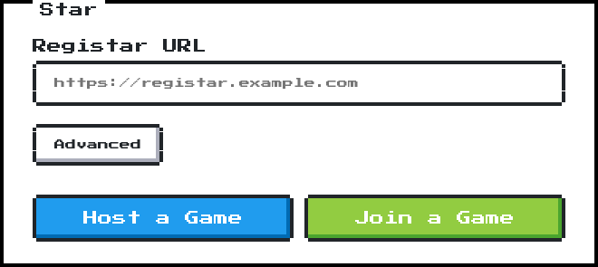
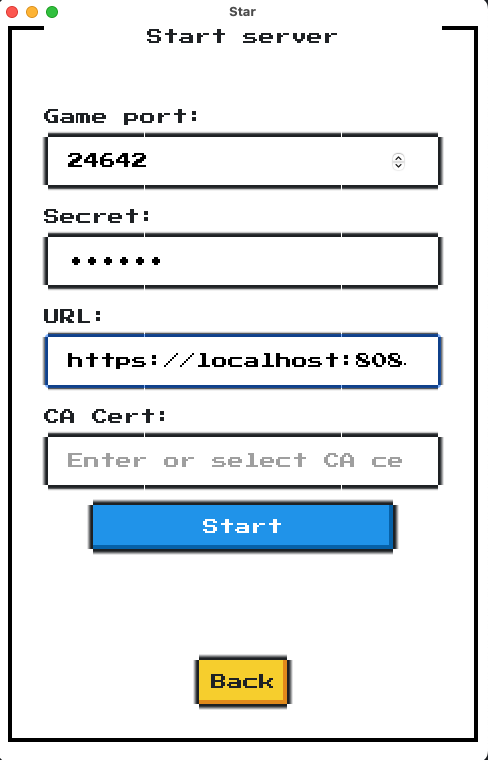
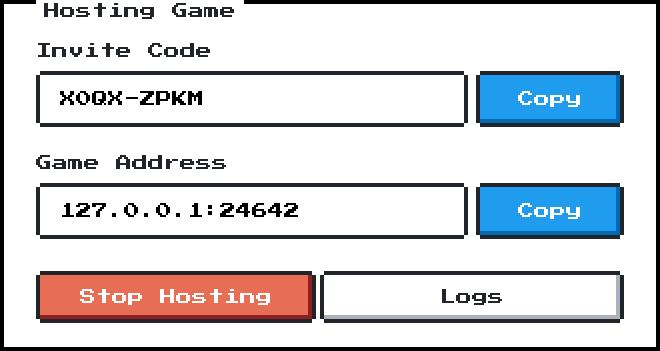
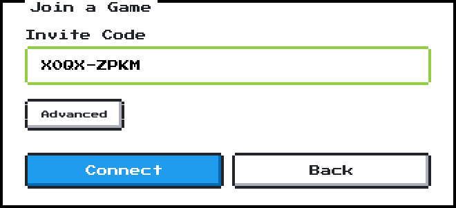
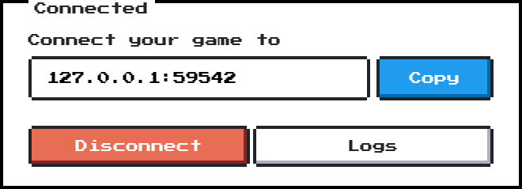
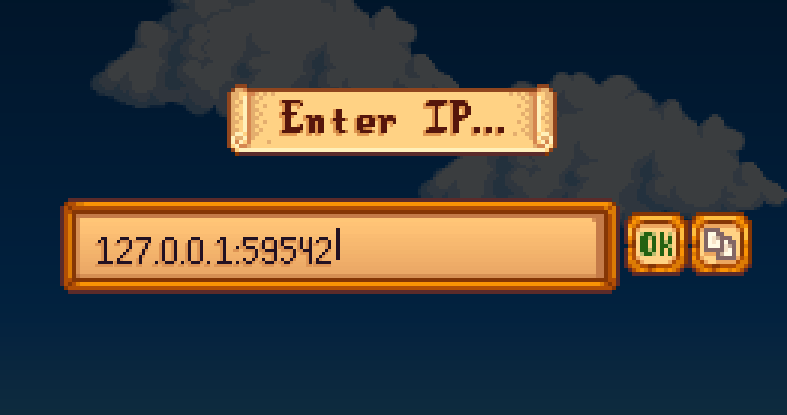

# Star ⭐

Ever wanted to play a local game with a friend who is far away? Star makes local multiplayer games playable remotely!

## How to Start

The application comes with two components: Registar, a server that manages connectivity between players,
and Star, a client that forwards UDP traffic. It has a GUI or can be used via CLI.

While a publicly available server is not ready yet (but coming soon!),
you can deploy your own Registar server and use it to connect with your friends.

### Deploy a Server

A pre-built Docker image is available at `ghcr.io/dmksnnk/star/registar`.

```yaml
services:
  registar:
    image: ghcr.io/dmksnnk/star/registar:latest
    restart: unless-stopped
    environment:
      - SECRET=your-secret-here        # or use SECRET_FILE with Docker secrets
      - CERT_DOMAINS=your-domain.com
      - CERT_DIR=/certs
    ports:
      - "80:80"          # HTTP unencrypted (redirects to HTTPS, used for ACME challenge)
      - "443:443/tcp"    # HTTP on top of TCP with TLS
      - "443:443/udp"    # HTTP/3 on top of UDP (QUIC)
    volumes:
      - certs:/certs

volumes:
  certs:
```

See [Registar Server](#registar-server) for all configuration options.

#### Deploying Behind a Reverse Proxy

Registar runs three services:
-  HTTP Server (TCP): Handles ACME challenges and redirects HTTP→HTTPS
-  HTTPS Server (TCP): Serves HTTP/1.1 & HTTP/2 and advertises HTTP/3 support via `Alt-Svc`.
-  HTTP/3 Server (UDP): Handles the actual QUIC game traffic.

Since Registar uses HTTP/3 (QUIC), it manages its own TLS certificates (via Let's Encrypt).
The parts that can be proxied are the HTTP and HTTPS servers,
but the HTTP/3 server must listen directly on the public UDP port (443/UDP),
because we need the client's public IP addresses for NAT hole-punching.

- Traffic to HTTP Server (TCP) can be routed normally via the proxy to `HTTP_LISTEN` (e.g., `:8080`). This handles redirects and ACME.
Do **not** enable `tlsChallenge` in Traefik - it intercepts TLS-ALPN-01 and Registar won't be able to complete its ACME challenge.
Use `httpChallenge` instead.
- Traffic to HTTPS Server (TCP) must be routed using **TCP Passthrough** to `HTTPS_LISTEN` (e.g., `:8443`).
The proxy should not terminate TLS for this service, as Registar manages its own certificates.
- Map the HTTP/3 Server UDP port directly to the host's public UDP port (e.g., `443:8443/udp`). This allows UDP traffic to coexist with Traefik's TCP traffic on port 443.

Here is an example of how to do it with Traefik:

**docker-compose.yaml** (registar service):
```yaml
services:
  registar:
    image: ghcr.io/dmksnnk/star/registar:latest
    restart: unless-stopped
    environment:
      - HTTP_LISTEN=:8080
      - HTTPS_LISTEN=:8443
      - CERT_DIR=/certs
      - CERT_DOMAINS=registar.example.com
      - HTTPS_ADVERTISE_HTTP3_PORT=443   # advertise public UDP port for HTTP/3
      - HTTPS_REDIRECT_PORT=443          # redirect to public HTTPS port
      - SECRET_FILE=/run/secrets/registar_secret
    ports:
      - "443:8443/udp"   # HTTP/3 (QUIC) — bypasses Traefik (UDP not proxied)
    volumes:
      - certs:/certs
    secrets:
      - registar_secret

volumes:
  certs:

secrets:
  registar_secret:
    file: ./registar_secret
```

**Traefik routes.yaml** (registar entries):
```yaml
http:
  routers:
    registar-http:
      entryPoints: [web]
      rule: "Host(`registar.example.com`)"
      service: registar-http
  services:
    registar-http:
      loadBalancer:
        servers:
          - url: "http://registar:8080"

tcp:
  routers:
    registar:
      entryPoints: [websecure]
      rule: "HostSNI(`registar.example.com`)"
      service: registar
      tls:
        passthrough: true   # registar handles TLS itself
  services:
    registar:
      loadBalancer:
        servers:
          - address: "registar:8443"
```

**traefik.yaml** (important — use `httpChallenge`, not `tlsChallenge`):
```yaml
certificatesResolvers:
  letsencrypt:
    acme:
      httpChallenge:
        entryPoint: web
```

### Game Host

If you are hosting the game, follow these steps:

1. Run the Star client. This should open a default browser.



2. Fill server's URL and a secret (the one you set in the registar server's `SECRET` env variable).
3. Click "Host a Game".
4. Select a game from the list or enter a custom port to forward to.



6. Click "Start Hosting".
7. Share the invite code with your friend.



### Game Peer

If you want only join a game, follow these steps:

1. Run the Star client. This should open a default browser.


2. Fill server's URL and a secret (the one you set in the registar server's `SECRET` env variable).
3. Click "Join a Game".
4. Enter the invite code you received from the host and click "Connect".



5. You will see the address where you can connect



6. Connect the game client to that address, here is an example from Stardew Valley:




## Registar Server Configuration

The server is configured using environment variables:

| Variable                     | Required                | Default     | Description                                                                 |
|------------------------------|-------------------------|-------------|-----------------------------------------------------------------------------|
| `SECRET`                     | Yes (or `SECRET_FILE`)  | —           | Shared secret to prevent unauthorized connections                           |
| `SECRET_FILE`                | Yes (or `SECRET`)       | —           | Path to a file containing the secret                                        |
| `LOG_LEVEL`                  | No                      | `INFO`      | Logging level: `INFO`, `DEBUG`                                              |
| `HTTP_LISTEN`                | No                      | `:80`       | HTTP listen address (redirects to HTTPS)                                    |
| `HTTPS_LISTEN`               | No                      | `:443`      | HTTPS and HTTP/3 listen address                                             |
| `HTTPS_ADVERTISE_HTTP3_PORT` | No                      | `443`       | Port advertised via `Alt-Svc` for HTTP/3 upgrade                            |
| `HTTPS_REDIRECT_PORT`        | No                      | `443`       | Port used in HTTP→HTTPS redirects                                           |
| `CERT_SELF_SIGNED`           | No                      | `false`     | Use a self-signed certificate instead of Let's Encrypt (useful for testing) |
| `CERT_DIR`                   | No                      | `certs`     | Directory where certificates are stored                                     |
| `CERT_DOMAINS`               | Yes (for Let's Encrypt) | `localhost` | Comma-separated list of domains for the certificate                         |

## Star CLI

When run without arguments, Star starts a local web UI server and opens it in the browser.
Set `LISTEN_ADDR` to override the default listen address (default: `127.0.0.1` with a system-assigned port).

```
star [GLOBAL OPTIONS] COMMAND [COMMAND OPTIONS]
```

### Global Options

| Flag          | Required | Default | Description                                                                               |
|---------------|----------|---------|-------------------------------------------------------------------------------------------|
| `--secret`    | Yes      | —       | Shared secret matching the registar server's `SECRET`                                     |
| `--registar`  | Yes      | —       | Registar server URL                                                                       |
| `--port`      | No       | `0`     | Local UDP listen port; `0` means system-assigned                                          |
| `--ca-cert`   | No       | —       | Path to a CA certificate file for the registar server (used for testing or custom setups) |
| `--log-level` | No       | `INFO`  | Logging level: `DEBUG`, `INFO`, `WARN`, `ERROR`                                           |

### Commands

#### `host` — Host a Game

```
star [GLOBAL OPTIONS] host [OPTIONS]
```

| Flag     | Required | Default | Description                                                        |
|----------|----------|---------|--------------------------------------------------------------------|
| `--port` | No       | `24642` | Local game port to forward traffic to (defaults to Stardew Valley) |
| `--key`  | No       | —       | Game key to register; if not set, a new key is generated           |

After starting, the game key is printed to stdout. Share it with your friend.

#### `peer` — Join a Game

```
star [GLOBAL OPTIONS] peer [OPTIONS]
```

| Flag            | Required | Default | Description                                                             |
|-----------------|----------|---------|-------------------------------------------------------------------------|
| `--key`         | Yes      | —       | Game key received from the host                                         |
| `--listen-port` | No       | `0`     | Local UDP port to listen on for game traffic; `0` means system-assigned |

After connecting, the local address to point your game client at is printed to stdout.

### Examples

Host a game on a custom port to forward traffic to:
```sh
star --secret mysecret --registar https://registar.example.com host --port 12345
```

Join a game:
```sh
star --secret mysecret --registar https://registar.example.com peer --key XXXX-XXXX
```


## How It Works

The Registar server acts as a control server and a relay. When both sides join the server,
it coordinates the NAT hole-punching to establish a direct P2P connection.
If it fails, the server instructs both clients to initiate a relay connection,
where the server forwards UDP traffic between them.

Everything above runs on top of QUIC/HTTP3, which makes every communication secured by TLS.
For P2P connections, the server acts as a certificate authority (CA). It creates a new intermediate CA for each session and
issues leaf certificates for both clients, so they can authenticate each other securely (mTLS).

The Star client is a UDP server that forwards UDP traffic over QUIC datagrams.

## Development

TODO: add

See [p2ptest/README.md](./internal/registar/p2p/p2ptest/README.md) about running integrations
tests for NAT hole-punching.

### HTTP/3

You can use a pre-built `curl` with HTTP/3 support from <https://github.com/stunnel/static-curl>.

Run in another terminal:

```sh
curl -Lv --cacert ca.crt --http3 http://localhost/-/health
```
